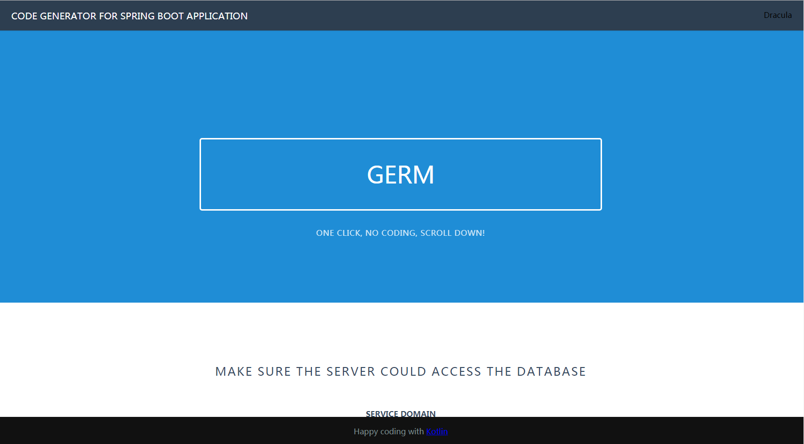

# Germ
## Code generator for Spring Boot Web Project

> This project is used to generate source code with spring boot from database.

## Feature
* Generated standard `MAVEN` project structure
* Generated file `pom.xml`
* Generated file `.gitignore`
* Generated spring boot configuration file `application.yml`
* Generated `Model`, `Repository`, `Service`, `Controller` layers
* Generated basic `CRUD` operations
* Swagger documentation
* Support multi development `env` 

## Language
- [x] Java (Current Supported)
- [ ] Kotlin
- [ ] Python
- [ ] Go

## Compilation & Running
1. Open file `App.kt`, update variable `DESTINATION_PARENT_DIR` to your system path, you can also update other configuration variables as you wish
2. Run `App.kt`
3. Access `http://localhost:8080`
4. Swagger document at `http://localhost:8080/swagger-ui.html`

## Deploy (if you running with jar file)
1. Run command below, `workingPath` refers to the generated zip file in which directory will be stored
    ```bash
    java -jar germ.jar [workingPath]
    ```   
2. Access `http://localhost:8080`

3. Swagger document at `http://localhost:8080/swagger-ui.html`


## Attention
* Currently only support for `PostgresSQL` 

